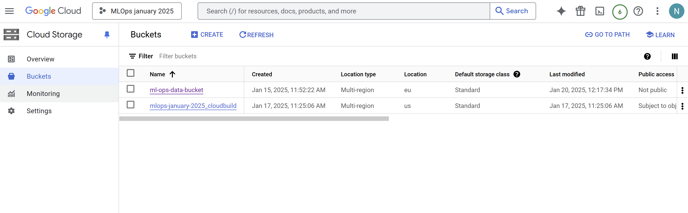

# Exam template for 02476 Machine Learning Operations

This is the report template for the exam. Please only remove the text formatted as with three dashes in front and behind
like:

```--- question 1 fill here ---```

Where you instead should add your answers. Any other changes may have unwanted consequences when your report is
auto-generated at the end of the course. For questions where you are asked to include images, start by adding the image
to the `figures` subfolder (please only use `.png`, `.jpg` or `.jpeg`) and then add the following code in your answer:

```markdown

```

In addition to this markdown file, we also provide the `report.py` script that provides two utility functions:

Running:

```bash
python report.py html
```

Will generate a `.html` page of your report. After the deadline for answering this template, we will auto-scrape
everything in this `reports` folder and then use this utility to generate a `.html` page that will be your serve
as your final hand-in.

Running

```bash
python report.py check
```

Will check your answers in this template against the constraints listed for each question e.g. is your answer too
short, too long, or have you included an image when asked. For both functions to work you mustn't rename anything.
The script has two dependencies that can be installed with

```bash
pip install typer markdown
```

## Overall project checklist

The checklist is *exhaustive* which means that it includes everything that you could do on the project included in the
curriculum in this course. Therefore, we do not expect at all that you have checked all boxes at the end of the project.
The parenthesis at the end indicates what module the bullet point is related to. Please be honest in your answers, we
will check the repositories and the code to verify your answers.

### Week 1

* [x] Create a git repository (M5)
* [x] Make sure that all team members have write access to the GitHub repository (M5)
* [x] Create a dedicated environment for you project to keep track of your packages (M2)
* [x] Create the initial file structure using cookiecutter with an appropriate template (M6)
* [x] Fill out the `data.py` file such that it downloads whatever data you need and preprocesses it (if necessary) (M6)
* [x] Add a model to `model.py` and a training procedure to `train.py` and get that running (M6)
* [x] Remember to fill out the `requirements.txt` and `requirements_dev.txt` file with whatever dependencies that you
    are using (M2+M6)
* [x] Remember to comply with good coding practices (`pep8`) while doing the project (M7)
* [x] Do a bit of code typing and remember to document essential parts of your code (M7)
* [x] Setup version control for your data or part of your data (M8)
* [ ] Add command line interfaces and project commands to your code where it makes sense (M9)
* [x] Construct one or multiple docker files for your code (M10)
* [x] Build the docker files locally and make sure they work as intended (M10)
* [x] Write one or multiple configurations files for your experiments (M11)
* [x] Used Hydra to load the configurations and manage your hyperparameters (M11)
* [x] Use profiling to optimize your code (M12)
* [x] Use logging to log important events in your code (M14)
* [x] Use Weights & Biases to log training progress and other important metrics/artifacts in your code (M14)
* [x] Consider running a hyperparameter optimization sweep (M14)
* [x] Use PyTorch-lightning (if applicable) to reduce the amount of boilerplate in your code (M15)

### Week 2

* [x] Write unit tests related to the data part of your code (M16)
* [x] Write unit tests related to model construction and or model training (M16)
* [x] Calculate the code coverage (M16)
* [x] Get some continuous integration running on the GitHub repository (M17)
* [x] Add caching and multi-os/python/pytorch testing to your continuous integration (M17)
* [x] Add a linting step to your continuous integration (M17)
* [x] Add pre-commit hooks to your version control setup (M18)
* [x] Add a continues workflow that triggers when data changes (M19)
* [ ] Add a continues workflow that triggers when changes to the model registry is made (M19)
* [x] Create a data storage in GCP Bucket for your data and link this with your data version control setup (M21)
* [x] Create a trigger workflow for automatically building your docker images (M21)
* [~] Get your model training in GCP using either the Engine or Vertex AI (M21)
* [x] Create a FastAPI application that can do inference using your model (M22)
* [ ] Deploy your model in GCP using either Functions or Run as the backend (M23)
* [ ] Write API tests for your application and setup continues integration for these (M24)
* [ ] Load test your application (M24)
* [ ] Create a more specialized ML-deployment API using either ONNX or BentoML, or both (M25)
* [x] Create a frontend for your API (M26)

### Week 3

* [~] Check how robust your model is towards data drifting (M27)
* [ ] Deploy to the cloud a drift detection API (M27)
* [ ] Instrument your API with a couple of system metrics (M28)
* [ ] Setup cloud monitoring of your instrumented application (M28)
* [ ] Create one or more alert systems in GCP to alert you if your app is not behaving correctly (M28)
* [ ] If applicable, optimize the performance of your data loading using distributed data loading (M29)
* [ ] If applicable, optimize the performance of your training pipeline by using distributed training (M30)
* [ ] Play around with quantization, compilation and pruning for you trained models to increase inference speed (M31)

### Extra

* [ ] Write some documentation for your application (M32)
* [ ] Publish the documentation to GitHub Pages (M32)
* [x] Revisit your initial project description. Did the project turn out as you wanted?
* [x] Create an architectural diagram over your MLOps pipeline
* [x] Make sure all group members have an understanding about all parts of the project
* [x] Uploaded all your code to GitHub


## Group information

### Question 1
> **Enter the group number you signed up on <learn.inside.dtu.dk>**
>
> Answer:

    Group 66

### Question 2
> **Enter the study number for each member in the group**
>
> Example:
>
> *sXXXXXX, sXXXXXX, sXXXXXX*
>
> Answer:

    s233559, s204103, s243739, s204256, s233557

### Question 3
> **A requirement to the project is that you include a third-party package not covered in the course. What framework**
> **did you choose to work with and did it help you complete the project?**
>
> Recommended answer length: 100-200 words.
>
> Example:
> *We used the third-party framework ... in our project. We used functionality ... and functionality ... from the*
> *package to do ... and ... in our project*.
>
> Answer:

    As a third party package we installed the transformers one from Hugging Face which allowed us to import a light version of the Bert transformer and use that pretrained model on our dataset. In fact we train this imported transformer on our data and adapt it to our task. This model for the small balanced dataset performs good but not so much better than a small neural network which we built for comparison. This is due to the fact that the strenght of the tranformers is shown when it comes to big dataset on which to train or finetune it, we will try to improve the model optimization with methods from various modules of the course as PyTorch-lightning and see how it behaves with training and testing on expanded versions of our small dataset, which they all will come from the big really unbalanced one we found on kaggle at "https://www.kaggle.com/datasets/mlg-ulb/creditcardfraud"

## Coding environment

> In the following section we are interested in learning more about you local development environment. This includes
> how you managed dependencies, the structure of your code and how you managed code quality.

### Question 4

> **Explain how you managed dependencies in your project? Explain the process a new team member would have to go**
> **through to get an exact copy of your environment.**
>
> Recommended answer length: 100-200 words
>
> Example:
> *We used ... for managing our dependencies. The list of dependencies was auto-generated using ... . To get a*
> *complete copy of our development environment, one would have to run the following commands*
>
> Answer:

We used pip for managing our dependencies. The list of dependencies is specified in the requirements.txt file. Additionally, we use Dependabot in GitHub to automatically check for and update dependencies to their latest versions, ensuring our project stays up-to-date. A new team member should start by cloning the github repo
	git clone https://github.com/GeorgeGeorgioy/MLOps_group_66.git
When pip is installed the new team member can just write:
pip install -r requirements.txt
Maybe create a new virtual environment before installing all the requirements. By following these steps, a new team member can replicate the exact development environment and start working on the project. 


### Question 5

> **We expect that you initialized your project using the cookiecutter template. Explain the overall structure of your**
> **code. What did you fill out? Did you deviate from the template in some way?**
>
> Recommended answer length: 100-200 words
>
> Example:
> *From the cookiecutter template we have filled out the ... , ... and ... folder. We have removed the ... folder*
> *because we did not use any ... in our project. We have added an ... folder that contains ... for running our*
> *experiments.*
>
> Answer:
In this project, we used the Cookiecutter template provided in the course. We chose to delete the notebook folder from the template since it was not used in our project. Although notebooks may be useful in the future, they are not needed at the moment. Additionally, we added a .dvc folder for data version control, as this folder contains the necessary metadata for tracking data changes.
Furthermore, by using Hydra and WandB, an outputs folder is automatically created. This folder tracks all the configurations for both Hydra and WandB, ensuring that every experiment can be  repeated. Finally, we did not need to add additional folders, only files that became necessary due to the specific way we implemented the model. 


### Question 6

> **Did you implement any rules for code quality and format? What about typing and documentation? Additionally,**
> **explain with your own words why these concepts matters in larger projects.**
>
> Recommended answer length: 100-200 words.
>
> Example:
> *We used ... for linting and ... for formatting. We also used ... for typing and ... for documentation. These*
> *concepts are important in larger projects because ... . For example, typing ...*
>
> Answer:

We used Ruff for both linting and formatting in our project. Ruff helps us ensure code quality and consistency. This is important in larger projects because they help each team member maintain a high standard of code quality. Which makes it easier to read, understand and maintain the code. This also makes the codebase more accessible for team members and future developers. Linting helps us catch potential errors and enforce coding standards While formatting ensures that the code follows the same style. These practices are essential in larger projects. We did not do any documentation but it definitely make sense to write clear and good documentation making it easier for new developers and for existing developers.

## Version control

> In the following section we are interested in how version control was used in your project during development to
> corporate and increase the quality of your code.

### Question 7

> **How many tests did you implement and what are they testing in your code?**
>
> Recommended answer length: 50-100 words.
>
> Example:
> *In total we have implemented X tests. Primarily we are testing ... and ... as these the most critical parts of our*
> *application but also ... .*
>
> Answer:

In this project we have implemented 5 tests. Primarily we are testing our dataloader and preprocessing and some part of the training class as these are the most critical parts of our code. For example the data test checks the len of a sample dataframe after the preprocessing and after there is a test that verifies that individual items can be retrieved correctly from the dataset.

### Question 8

> **What is the total code coverage (in percentage) of your code? If your code had a code coverage of 100% (or close**
> **to), would you still trust it to be error free? Explain you reasoning.**
>
> Recommended answer length: 100-200 words.
>
> Example:
> *The total code coverage of code is X%, which includes all our source code. We are far from 100% coverage of our **
> *code and even if we were then...*
>
> Answer:
The total code coverage of code is 25%, which includes all our source code. We are far from 100% coverage of our. Even if we achieved 100% code coverage, it would not guarantee that the code is error free. Code coverage measures how much of the code is executed during the tests, but it does not ensure that all possible cases and scenarios are tested. And high code coverage does not account for the quality of the tests themselves. Therefore, while high code coverage is a good indicator of thorough testing, it should be complemented with other testing strategies such as integration tests, end-to-end tests, and manual testing to ensure the correctness of the code.

--- question 8 fill here ---

### Question 9

> **Did you workflow include using branches and pull requests? If yes, explain how. If not, explain how branches and**
> **pull request can help improve version control.**
>
> Recommended answer length: 100-200 words.
>
> Example:
> *We made use of both branches and PRs in our project. In our group, each member had an branch that they worked on in*
> *addition to the main branch. To merge code we ...*
>
> Answer:
> In this project we opted to mostly avoid branches and pull requests due to most members of the group not being used to work in that workflow. We had one instance of a PR merge since some changes required a lot of testing before being able to enter the main branch. It seemed more suitable for pull requests to be used in a larger scale project. Pull requests have a lot of positives when working on larger projects such as being able to do feature based branches, where it is very clear what happens in each merge with main. This makes it very easy to trace back where something happened in the stream. As well as this it also ensures that no-one pushes something to main alone, thus reducing the possibilities of errors. Having separate branches also makes testing features before merging into main easier, since you have the entire branch available beforehand as a preview.


### Question 10

> **Did you use DVC for managing data in your project? If yes, then how did it improve your project to have version**
> **control of your data. If no, explain a case where it would be beneficial to have version control of your data.**
>
> Recommended answer length: 100-200 words.
>
> Example:
> *We did make use of DVC in the following way: ... . In the end it helped us in ... for controlling ... part of our*
> *pipeline*
>
> Answer:
> In this project we used DVC and synced it up to google cloud storage. This was helpful for the project, since tracking changes to the data was easy to find. However, DVC was mostly used to ensure that the data was shareable amongst team members, since some of the data files were too big for github to handle, therefore the cloud storage solution could be in charge of this. Additionally, the DVC integration provides a scalable solution for handling large datasets, which otherwise could not be in our github repository. This setup improved collaboration and efficiency within our team, as data management became more streamlined.


### Question 11

> **Discuss you continuous integration setup. What kind of continuous integration are you running (unittesting,**
> **linting, etc.)? Do you test multiple operating systems, Python  version etc. Do you make use of caching? Feel free**
> **to insert a link to one of your GitHub actions workflow.**
>
> Recommended answer length: 200-300 words.
>
> Example:
> *We have organized our continuous integration into 3 separate files: one for doing ..., one for running ... testing*
> *and one for running ... . In particular for our ..., we used ... .An example of a triggered workflow can be seen*
> *here: <weblink>*
>
> Answer:
We have organized our continuous integration into 4 separate files:
tests.yaml: This file is used for running unit tests on Python versions 3.11 and 3.12, and on operating systems Ubuntu and macOS. It ensures that our code works correctly across different environments. The test also gives us coverage reporting. We used caching to make the test run faster. The workflow can be seen here: https://github.com/GeorgeGeorgioy/MLOps_group_66/actions/workflows/tests.yaml
codecheck.yaml: This file implements Ruff for both linting and formatting on push and pull request events to the main branch. It ensures that our code match the style guidelines and is free of common errors. 
pre_commit.yaml: This file is used to run pre-commit hooks on push and pull request events to the main branch. It sets up Python 3.11, installs pre-commit, and runs the pre-commit checks. This helps catch issues early in the development process before they are merged into the main branch.
cml_data.yaml: This file automatically triggers and runs the dataset_statistics.py when data changes. The file just calculates some basic statistics for the dataset. It ensures that our data processing scripts are up-to-date and that any changes to the data are reflected in the statistics.


## Running code and tracking experiments

> In the following section we are interested in learning more about the experimental setup for running your code and
> especially the reproducibility of your experiments.

### Question 12

> **How did you configure experiments? Did you make use of config files? Explain with coding examples of how you would**
> **run a experiment.**
>
> Recommended answer length: 50-100 words.
>
> Example:
> *We used a simple argparser, that worked in the following way: Python  my_script.py --lr 1e-3 --batch_size 25*
>
> Answer:

We used Hydra to configure and manage experiments efficiently. A config.yaml file was created to initialize hyperparameters for reproducibility and flexibility. The config.yaml file is located in the configs folder. To run the experiments, we simply execute train.py to train the model or __main__.py to train and evaluate the model. For running an experiment, we can use:
python train.py +lr=<new_lr> +batch_size=<new_batch_value>
This way, the existing hyperparameter values are overridden to test new configurations.


### Question 13

> **Reproducibility of experiments are important. Related to the last question, how did you secure that no information**
> **is lost when running experiments and that your experiments are reproducible?**
>
> Recommended answer length: 100-200 words.
>
> Example:
> *We made use of config files. Whenever an experiment is run the following happens: ... . To reproduce an experiment*
> *one would have to do ...*
>
> Answer:

We ensured the reproducibility of experiments by using Hydra and WandB for configuration management and experiment tracking. All hyperparameters,and model configurations were stored in a config.yaml file located in the configs folder. 
When an experiment is run, Hydra saves the configuration used for that specific run into an automatically generated outputs folder. This ensures the exact setup of each experiment is recorded, enabling reproducibility. Additionally, we used WandB to log hyperparameters, metrics, and training progress in real time. So, all experimental details, including the config file and performance metrics are stored on wandb platform.
To reproduce an experiment, one simply needs to re-run the same configuration file by referencing the saved config.yaml or reloading the experiment through WandB, for example we run: python train.py hydra.run.dir=outputs\2025-01-21\13-29-13 to reproduced that specific experiment.


### Question 14

> **Upload 1 to 3 screenshots that show the experiments that you have done in W&B (or another experiment tracking**
> **service of your choice). This may include loss graphs, logged images, hyperparameter sweeps etc. You can take**
> **inspiration from [this figure](figures/wandb.png). Explain what metrics you are tracking and why they are**
> **important.**
>
> Recommended answer length: 200-300 words + 1 to 3 screenshots.
>
> Example:
> *As seen in the first image when have tracked ... and ... which both inform us about ... in our experiments.*
> *As seen in the second image we are also tracking ... and ...*
>
> Answer:

For weight and biases we tried to make appear the most meaningful plots for our tasks, in this case since it is a binary classification between frauds and not frauds on credit card transactions it would be a confusion matrix at the end of every epoch optimally. Also the accuracy of the model and the f1 score are available through the python scripts but are not displayed in the main panels of weight and biases. It turns out that this transformer is a bit too complex as an architecture for this task and with this very small balanced dataset so I think it is underfitting the architecture during the training, despite this it reach an accuracy around 90% and the confusion matrix help us to see not only that it struggles but also how. This is really important because even though is not the most adapt model for the task or it should be fine tuned in a more suitable way we can notice that is more likely that identify a non fraud as a fraud than the opposite, this is usually what you prefer from the model in this kind of application when having the same accuracy. Furthermore it’s really useful the weight and biases computational usage section in which you can see how much memory and computational power the run is taking from your resources, so it’s useful to see if your using your computational power in the better way and also if there are some problems on the run it allows you to understand if it was to an overload of your capacity, this can be easily seen when running bigger batches for the transformer on a cpu.(the confusion matrix is from an early run in which the pictures were nicer but the model was trained really poorly to increase the speed without caring about the final accuracy for the moment).


### Question 15

> **Docker is an important tool for creating containerized applications. Explain how you used docker in your**
> **experiments/project? Include how you would run your docker images and include a link to one of your docker files.**
>
> Recommended answer length: 100-200 words.
>
> Example:
> *For our project we developed several images: one for training, inference and deployment. For example to run the*
> *training docker image: `docker run trainer:latest lr=1e-3 batch_size=64`. Link to docker file: <weblink>*
>
> Answer:

Since the project worked locally on all the group members pc’s we mainly used docker to attempt to speed up hyper parameter sweeps on the cloud. Therefore we set up the cloud build service on google to automatically trigger when pushes were made to GitHub. This then built docker images and store them in the cloud. These images were then used to ensure that training models on the cloud were always using the latest docker image of the code. This ensure that code and environments are easily reproducible, by loading in the image which can be run on virtual machines. A docker image can be found on the following link: europe-west1-docker.pkg.dev/mlops-january-2025/ml-ops-group-66/latest-image@sha256:d5f52f916a94b676adb787bf27887bc90731b55ca9c8b446e8cd58893139493c 

### Question 16

> **When running into bugs while trying to run your experiments, how did you perform debugging? Additionally, did you**
> **try to profile your code or do you think it is already perfect?**
>
> Recommended answer length: 100-200 words.
>
> Example:
> *Debugging method was dependent on group member. Some just used ... and others used ... . We did a single profiling*
> *run of our main code at some point that showed ...*
>
> Answer:

Every group member used the debugger to look for errors in our project. Some of us already knew how to use it, so we taught the others how to use it effectively. In addition, websites like StackOverflow and AI-based tools were extremely useful to understand where the problem was and how to fix it. We also made use of logging to track the flow of the program and identify where things were going wrong. We did not use profiling but it could have helped us optimize the code by finding slow functions and inefficient code paths. This approach could help ensure that our code is not only functional but also efficient, which is crucial for training on large datasets.

## Working in the cloud

> In the following section we would like to know more about your experience when developing in the cloud.

### Question 17

> **List all the GCP services that you made use of in your project and shortly explain what each service does?**
>
> Recommended answer length: 50-200 words.
>
> Example:
> *We used the following two services: Engine and Bucket. Engine is used for... and Bucket is used for...*
>
> Answer:

>In this project we used multiple GCP services. Firstly we used Bucket, which we used to store our data for the project, by connecting it to our data version control. This allowed us to share data with each other and keep track of the changes made to the data. Secondly we used the artifact registry to automatically build and store docker images of the projects whenever a change was pushed to the main git branch. We also used Compute to train models on virtual machines, where we integrated the work with vertex AI to automate the process of creating VM’s, loading containers and training models.

### Question 18

> **The backbone of GCP is the Compute engine. Explained how you made use of this service and what type of VMs**
> **you used?**
>
> Recommended answer length: 100-200 words.
>
> Example:
> *We used the compute engine to run our ... . We used instances with the following hardware: ... and we started the*
> *using a custom container: ...*
>
> Answer:

We used the compute engine to run our model trainings. We configured the training to run with the n1-highmem-2 machine types, which is a CPU only machine. This was because We had trouble finding available GPU’s and debugging was easier on CPU only machines. We mostly interacted with the compute engine using the vertex AI custom training jobs, since these allowed for easy configuration. For more testing configuring the VM’s to be run with nvidia GPU’s would significantly speed up the training process, while also being more expensive to run. Using the Vertex AI jobs also allowed us to always use the latest Docker images which were automatically built and stored in the Google Artifact Registry.

### Question 19

> **Insert 1-2 images of your GCP bucket, such that we can see what data you have stored in it.**
> **You can take inspiration from [this figure](figures/bucket.png).**
>
> Answer:



### Question 20

> **Upload 1-2 images of your GCP artifact registry, such that we can see the different docker images that you have**
> **stored. You can take inspiration from [this figure](figures/registry.png).**
>
> Answer:


### Question 21

> **Upload 1-2 images of your GCP cloud build history, so we can see the history of the images that have been build in**
> **your project. You can take inspiration from [this figure](figures/build.png).**
>
> Answer:


### Question 22

> **Did you manage to train your model in the cloud using either the Engine or Vertex AI? If yes, explain how you did**
> **it. If not, describe why.**
>
> Recommended answer length: 100-200 words.
>
> Example:
> *We managed to train our model in the cloud using the Engine. We did this by ... . The reason we choose the Engine*
> *was because ...*
>
> Answer:

We set up training the model in the cloud using Vertex AI. We chose Vertex AI in order to easily set up vm’s and configure them to make hyper-parameter sweeps. However, we were unsuccessful in training the model due to complications with errors regarding Weights and Biases, since we couldn’t set up authentication properly in the given time-frame. In a future projects this would most likely be achieved, either by making checks in the code to only do Weights and Biases if it was authenticated, or by implementing the following guide to setup Weights and Biases to be useable in the cloud environment: https://docs.wandb.ai/guides/launch/setup-vertex/. 

## Deployment

### Question 23

> **Did you manage to write an API for your model? If yes, explain how you did it and if you did anything special. If**
> **not, explain how you would do it.**
>
> Recommended answer length: 100-200 words.
>
> Example:
> *We did manage to write an API for our model. We used FastAPI to do this. We did this by ... . We also added ...*
> *to the API to make it more ...*
>
> Answer:

We added APIs for our model using FastAPI in the file api.py. Through our APIs it is possible to train the model (get), to visualize the results of our evaluation (get), to visualize the current hyperparameters that are used to train the model (get), and to modify them in order to retrain the model (post). We also attempted to create a simple frontend for our application with html, always in the api.py file. We used FastAPI's built-in features for request validation and response formatting, which helped us maintain a clean and efficient codebase. The API is allowing a seamless interaction with the underlying machine learning processes.


### Question 24

> **Did you manage to deploy your API, either in locally or cloud? If not, describe why. If yes, describe how and**
> **preferably how you invoke your deployed service?**
>
> Recommended answer length: 100-200 words.
>
> Example:
> *For deployment we wrapped our model into application using ... . We first tried locally serving the model, which*
> *worked. Afterwards we deployed it in the cloud, using ... . To invoke the service an user would call*
> *`curl -X POST -F "file=@file.json"<weburl>`*
>
> Answer:
Unfortunately we didn’t manage to deploy our APIs into the cloud because of some problem with integrating GCP with Weights and Biases authentication. They were successfully deployed locally instead. In order to see it we played with the browser’s navigation bar to navigate ad check that all the requests were made correctly, before trying to create a simple html frontend. From the api we are able to run the python files of training and testing and modifying the hyperparameters from the front end, but the training and evaluation with hydra that works just fine from local and is able to log the plots to weight and biases is not able to be called from the api frontend as well.


### Question 25

> **Did you perform any unit testing and load testing of your API? If yes, explain how you did it and what results for**
> **the load testing did you get. If not, explain how you would do it.**
>
> Recommended answer length: 100-200 words.
>
> Example:
> *For unit testing we used ... and for load testing we used ... . The results of the load testing showed that ...*
> *before the service crashed.*
>
> Answer:
We did not perform any unit testing and load testing of our API. But it makes sense to write tests for our API since we have implemented an API but due to time, we didn’t have any tests. If we implement it we could use a liberty like pytest, we could write tests to test individual endpoints and their functionality in isolation. We would write test cases to verify key functionalities, such as response correctness, status codes, and error handling. For load testing, we could simulate many users accessing the API in a short timeframe. If our API consistently maintained a low response time and no server crashes, we would consider it successful. The goal would be to ensure the API remains reliable and performance even under high traffic conditions.


### Question 26

> **Did you manage to implement monitoring of your deployed model? If yes, explain how it works. If not, explain how**
> **monitoring would help the longevity of your application.**
>
> Recommended answer length: 100-200 words.
>
> Example:
> *We did not manage to implement monitoring. We would like to have monitoring implemented such that over time we could*
> *measure ... and ... that would inform us about this ... behaviour of our application.*
>
> Answer:

No, we were unable to introduce any monitoring to the project. Still, we applied the evidently package in the project to assess the shift in a more balanced portion of our dataset from the original distribution. We subjected this dataset to processing with PCA since it is sensitive, comprising credit card information.
If the model is to be deployed and monitored, evidently can certainly play a major role in monitoring how the PCA features shift over time with new incoming data. Monitoring will help detect any significant distribution shifts so that the model remains effective in detecting fraud. By detecting these drifts early, one could take corrective action on potential degradation in performance, retraining the model if necessary, and ensuring its longevity and reliability in a real-world environment. This proactive approach would be crucial for maintaining the model's accuracy and adapting to evolving patterns in the data.


## Overall discussion of project

> In the following section we would like you to think about the general structure of your project.

### Question 27

> **How many credits did you end up using during the project and what service was most expensive? In general what do**
> **you think about working in the cloud?**
>
> Recommended answer length: 100-200 words.
>
> Example:
> *Group member 1 used ..., Group member 2 used ..., in total ... credits was spend during development. The service*
> *costing the most was ... due to ... . Working in the cloud was ...*
>
> Answer:

Group member s204103 spent approximately $10 in credits during the development of the project. The cost was mainly associated with running VMs in the Compute Engine, with a significant portion attributed to upkeep, as the student forgot to turn off one of the VMs for an extended period. The remaining cost was primarily incurred while attempting to perform hyperparameter sweeps in Vertex AI. 
The goal was to run multiple experiments with different combinations of hyperparameters to ultimately identify the optimal set. However, the full sweep was never completed due to communication issues between the cloud setup and the WandB platform.


### Question 28

> **Did you implement anything extra in your project that is not covered by other questions? Maybe you implemented**
> **a frontend for your API, use extra version control features, a drift detection service, a kubernetes cluster etc.**
> **If yes, explain what you did and why.**
>
> Recommended answer length: 0-200 words.
>
> Example:
> *We implemented a frontend for our API. We did this because we wanted to show the user ... . The frontend was*
> *implemented using ...*
>
> Answer:

We added a simple front-end to our FastAPI application in order to make APIs usage more intuitive. Our front-end was made with html, and below you can see a screenshot. It is made of this homepage, and the outputs of the APIs are displayed below the “Evaluate” button.


### Question 29

> **Include a figure that describes the overall architecture of your system and what services that you make use of.**
> **You can take inspiration from [this figure](figures/overview.png). Additionally, in your own words, explain the**
> **overall steps in figure.**
>
> Recommended answer length: 200-400 words
>
> Example:
>
> *The starting point of the diagram is our local setup, where we integrated ... and ... and ... into our code.*
> *Whenever we commit code and push to GitHub, it auto triggers ... and ... . From there the diagram shows ...*
>
> Answer:

The diagram starts from two ends, first of all its from we, the developers’ local setup. In order to synchronize work and use version control we use github, where we can push and pull from the main branch. To handle data version control we can also use DVC push and pull to ensure that everyone’s data is up to date at all time. Whenever we push to github it auto triggers the Google cloud build which builds docker files from a cloudbuild configuration file, which builds using a docker file. After the images are built they are stored in the google artifact registry. These images can then be accessed by Vertex AI, which helps set up a VM with the docker image which is then run on the google compute engine to train models in the cloud. This can be achieved by the developer by the terminal interface from a configuration file. When setting up experiments the developer uses a Hydra config file, which assists with hyperparameter settings. This is then trained either locally or in the cloud. The model training and evaluation is logged using Weights and Biases. 
From a users point of view, the way they interact with the model is through the API Interface. This is then used to trian locally, since we didn’t have time to implement the API cloud interface, which in future iterations should be able to draw the latest trained model from the compute engine, through the API.

### Question 30

> **Discuss the overall struggles of the project. Where did you spend most time and what did you do to overcome these**
> **challenges?**
>
> Recommended answer length: 200-400 words.
>
> Example:
> *The biggest challenges in the project was using ... tool to do ... . The reason for this was ...*
>
> Answer:

This project offered big challenges especially for the members of the group that weren’t familiar with DevOps or the handling of a programming project that needs communication across many files and softwares. We improved a bit our git knowledge that at the beginning gave some problem when came to handle big files before getting to know version control, then the communication in general between api, gcp and weight and biases made us struggle a lot in the implementation of the code, such that still now there are some problems with some files that are able to run from local and api but not on the cloud or the other way around. For example weight and biases needed some kind of authentication to run on gcp but we didn’t manage to build the communication between this two services. Also the implementation with pytorch-lightning seemed a bit odd in the beginning to the people used to work with the classic torch(nn.module), but in the end it turned out to be quite useful when it comes to training and testing after having stated all the functions in the model, in particular for what regards the hyperparameters. It was also hard to get GCP to play nice, since it required many factors to play nice together. For this we needed a dockerfile, a cloudbuild file and a vertex ai configuration file to make the system work. Running the entire process of building an image, setting up a VM, and training the model was very time consuming 

### Question 31

> **State the individual contributions of each team member. This is required information from DTU, because we need to**
> **make sure all members contributed actively to the project**
>
> Recommended answer length: 50-200 words.
>
> Example:
> *Student sXXXXXX was in charge of developing of setting up the initial cookie cutter project and developing of the*
> *docker containers for training our applications.*
> *Student sXXXXXX was in charge of training our models in the cloud and deploying them afterwards.*
> *All members contributed to code by...*
>
> Answer:

*Student s204256 was in charge of unit test, coverage, continuous integration, continuous workflow.
*Student s243739 worked mainly on code refactoring, code organization, APIs, dockerfiles and GCP.
Student s204103 worked mainly with code structure, data version control, GCP features including data storage, automatic docker cloudbuilds, compute engine training, automation of compute engine using vertex ai.
*Student 233557 worked mainly on the models the training and testing code, part of the integration with the weight and biases interface, pytorch lightning implementation and the basic idea on the data drifting.
*Student 233559 worked mainly with  configuration experiments using Hydra, we incorporated logging and hyperparameter sweeping through the WandB platform and  with API.
